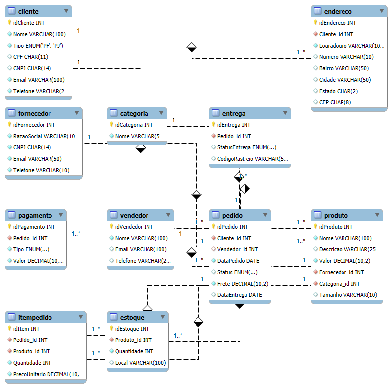

# 🛒 Estruturação de Dados para E-commerce – Modelagem Relacional

## 📌 Contexto

Em operações de e-commerce, análises confiáveis dependem diretamente da qualidade e organização dos dados.

Sem uma estrutura bem definida, torna-se difícil responder perguntas básicas como:

- Qual a performance de vendas por cliente ou produto  
- Quais fornecedores impactam mais o resultado  
- Como está o nível de estoque e sua relação com pedidos  
- Qual o comportamento de pedidos, pagamentos e entregas  

Este projeto simula a construção de uma base estruturada para suportar esse tipo de análise.

---

## 🎯 Objetivo

Desenvolver um modelo de dados relacional capaz de:

- Organizar informações operacionais de um e-commerce  
- Garantir integridade e consistência dos dados  
- Permitir análises estruturadas via SQL  
- Servir como base para dashboards e relatórios gerenciais  

---

## 🧠 Abordagem

A construção do modelo seguiu princípios de modelagem relacional e organização para análise:

- Definição de entidades e relacionamentos  
- Normalização das tabelas  
- Uso de chaves primárias e estrangeiras  
- Aplicação de constraints para integridade  
- Estruturação orientada a consultas analíticas  

---

## 🗺️ Modelo de Dados

O modelo foi estruturado para representar as principais operações de um e-commerce:

- Clientes (PF e PJ)  
- Produtos, categorias e fornecedores  
- Pedidos e itens de pedido  
- Pagamentos e entregas  
- Controle de estoque  
- Vendedores  

---

## 📊 Aplicação Analítica (SQL)

A base construída permite responder perguntas de negócio como:

- Quantos pedidos foram feitos por cliente  
- Quais produtos têm maior volume ou receita  
- Relação entre fornecedores e produtos vendidos  
- Situação de estoque por item  
- Desempenho de vendedores  
- Status logístico de pedidos e entregas  

---

## ⚙️ Estrutura do Projeto

- `create_database.sql` → criação das tabelas e estrutura  
- `insert_data.sql` → inserção de dados fictícios  
- `queries.sql` → consultas analíticas  

---

## 🧪 Exemplos de Análises

Foram desenvolvidas queries utilizando:

- `JOIN` para relacionar entidades  
- `GROUP BY` e `HAVING` para agregações  
- Cálculo de métricas (ex: total por pedido)  
- Filtros por status, tipo e valor  

---

## 📈 Valor do Projeto

Este projeto demonstra como uma boa estrutura de dados:

- Facilita a análise e interpretação de informações  
- Garante consistência e confiabilidade  
- Permite construção de dashboards e relatórios  
- Serve como base para tomada de decisão  

---

## 🛠️ Tecnologias utilizadas

MySQL • SQL  

---

## 👤 Sobre mim

Atuo na interseção entre **finanças, dados e tecnologia**, com foco em estruturar e analisar informações para suporte à decisão.

---

## 📌 Observações

Projeto desenvolvido para fins de portfólio.
